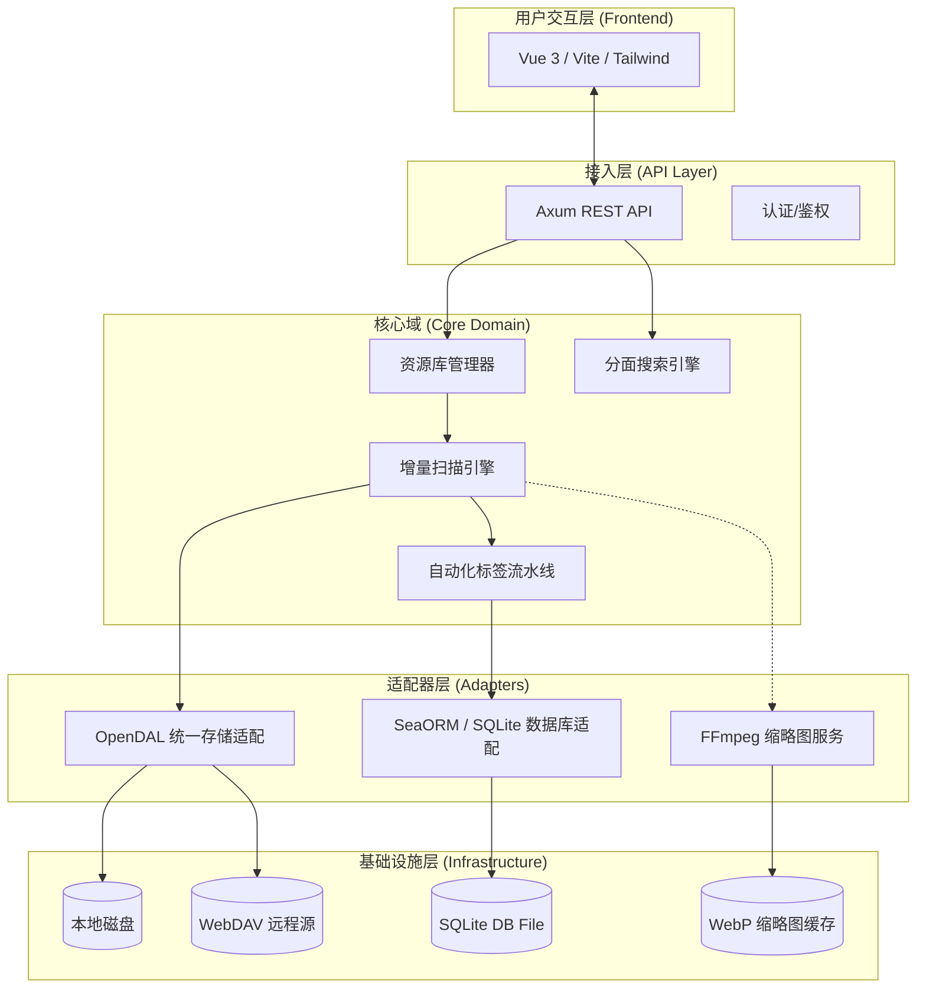
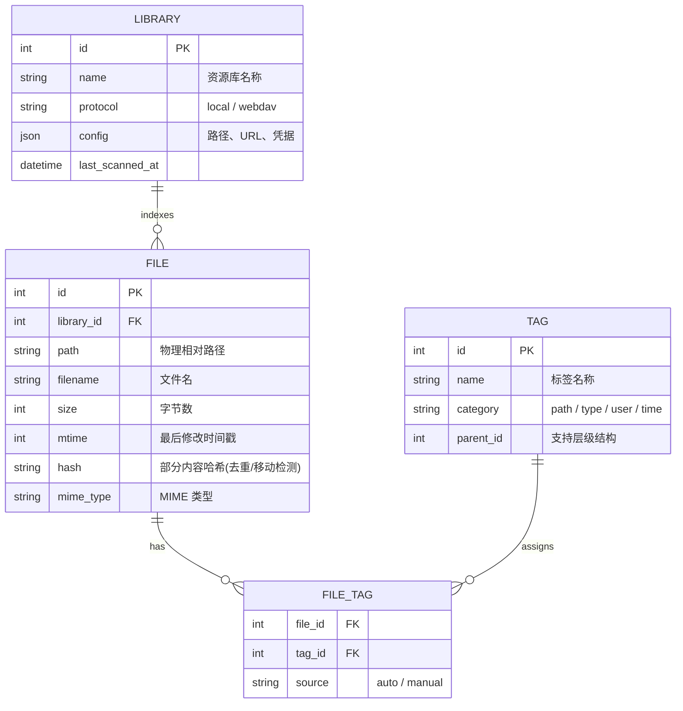
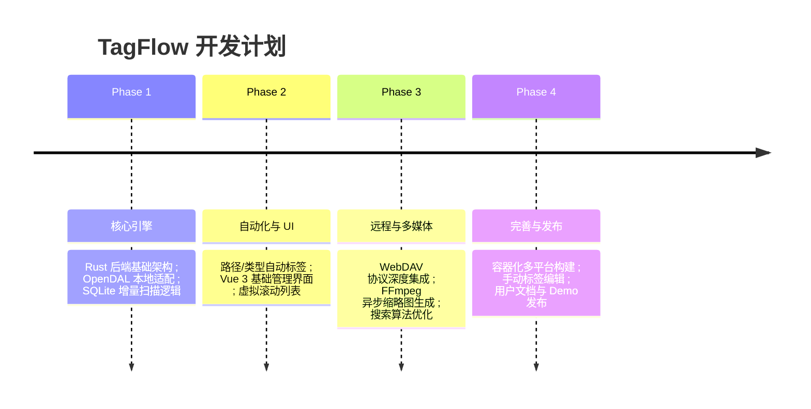

这是一份基于《需求调研报告》深度整合后的**《TagFlow 轻量级标签化个人资源管理系统概要设计文档》**。

---

# TagFlow 系统概要设计文档 (High-Level Design)

## 1. 概述

### 1.1 项目愿景
TagFlow 旨在解决个人数据膨胀背景下，传统层级目录（文件夹）管理维度的局限性。系统通过“元数据覆盖层”技术，在不破坏物理文件结构的前提下，实现多维标签化管理与语义检索。

### 1.2 核心设计原则
*   **非侵入性 (Non-Intrusive)：** 不修改原始文件名，不写入 Sidecar 文件，所有元数据存储在独立数据库。
*   **自动化 (Automation)：** 基于路径、类型和属性自动生成初始标签，降低用户整理负担。
*   **极简主义 (Minimalism)：** 单体架构、内嵌数据库、低内存占用，适配 NAS 及嵌入式设备。
*   **多源融合 (Multi-source)：** 统一管理本地磁盘与远程 WebDAV 资源。

---

## 2. 系统架构设计

系统采用**六边形架构 (Hexagonal Architecture)**，将核心业务逻辑与外部存储协议及 UI 展现解耦。

---

## 3. 技术栈选型

| 维度 | 选型 | 理由 |
| :--- | :--- | :--- |
| **后端语言** | **Rust** | 内存开销确定性强（无 GC），适合资源受限的 NAS 环境。 |
| **存储抽象** | **OpenDAL** | 核心组件。统一处理 Local 和 WebDAV 接口，极大地简化多源支持逻辑。 |
| **数据库** | **SQLite** | 单文件零维护。开启 **WAL 模式** 支持并发读写。 |
| **Web 框架** | **Axum** | 基于 Tokio，高性能异步架构，与 Rust 生态兼容度高。 |
| **前端框架** | **Vue 3 + Pinia** | 轻量级富客户端逻辑，支持复杂的文件多选与状态管理。 |
| **多媒体处理** | **FFmpeg** | 工业级视频封面与元数据提取标准。 |

---

## 4. 数据库逻辑设计 (ERD)

---

## 5. 核心模块与算法设计

### 5.1 增量扫描算法 (Differential Sync)
为保证扫描性能，系统不采用全量重写，而是基于元数据比对：
1.  **加载快照：** 从数据库加载该资源库已存的 `(path, size, mtime)` 映射表至内存 Map。
2.  **迭代遍历：** 递归扫描物理系统。
    *   若 `path` 存在且 `size/mtime` 未变：从内存 Map 中移除该项。
    *   若 `path` 存在但已变：更新记录并触发标签引擎。
    *   若为新路径：新增记录并触发标签引擎。
3.  **清理失效：** 遍历结束后，内存 Map 中剩余的记录即为已删除文件，执行数据库清理。

### 5.2 自动化标签引擎 (Tagging Pipeline)
文件索引建立后，依次进入标签生成器流水线：
*   **Path Tagger:** 将路径深度 `n` 层以上的文件夹名转化为标签（如 `2023/日本旅行` -> `#2023`, `#日本旅行`）。
*   **Type Tagger:** 根据拓展名归类（如 `.mp4`, `.mkv` -> `#type:video`）。
*   **Time Tagger:** 解析修改时间转化为层级标签（如 `#year:2024`, `#month:2024-05`）。

### 5.3 WebDAV 性能优化策略
*   **连接池管理：** 限制并发请求数（Semaphore），避免触发远程服务器 DDoS 保护。
*   **ETag 利用：** 若服务器支持 ETag，扫描时优先比对 ETag，跳过元数据详细检查。
*   **元数据缓存：** 前端浏览请求优先命中本地 SQLite 索引，仅在用户触发“同步”时才与 WebDAV 交互。

---

## 6. 前端交互设计

### 6.1 分面搜索 (Faceted Search)
*   **多维度过滤器：** 侧边栏提供标签云，支持 `AND`（交集）逻辑过滤。
*   **面包屑视图：** `Home > #type:image > #2024`，实现逻辑层面的“虚拟文件夹”。

### 6.2 虚拟滚动列表 (Virtual Grid)
针对 10 万+ 文件场景，前端采用**虚拟滚动 (Virtual Scrolling)** 技术：
*   只渲染当前视口可见的 DOM 节点。
*   固定高度网格，通过位移（TranslateY）模拟滚动效果，确保页面不卡顿。

---

## 7. 非功能性需求与部署

### 7.1 性能指标
*   **冷启动内存：** < 50MB (Alpine Docker)。
*   **扫描速度：** 本地文件系统 > 5000 文件/秒；WebDAV 视带宽与延迟而定。
*   **响应延迟：** 10万级数据下，复杂标签过滤 API 响应 < 200ms。

### 7.2 部署架构
*   **Docker 一键部署：** 提供 `docker-compose.yml`，包含后端二进制与前端静态资源。
*   **只读挂载保障：** 推荐用户将资源目录以 `:ro` (Read-Only) 模式挂载，确保数据绝对安全。

---

## 8. 开发路线图 (Roadmap)

---

