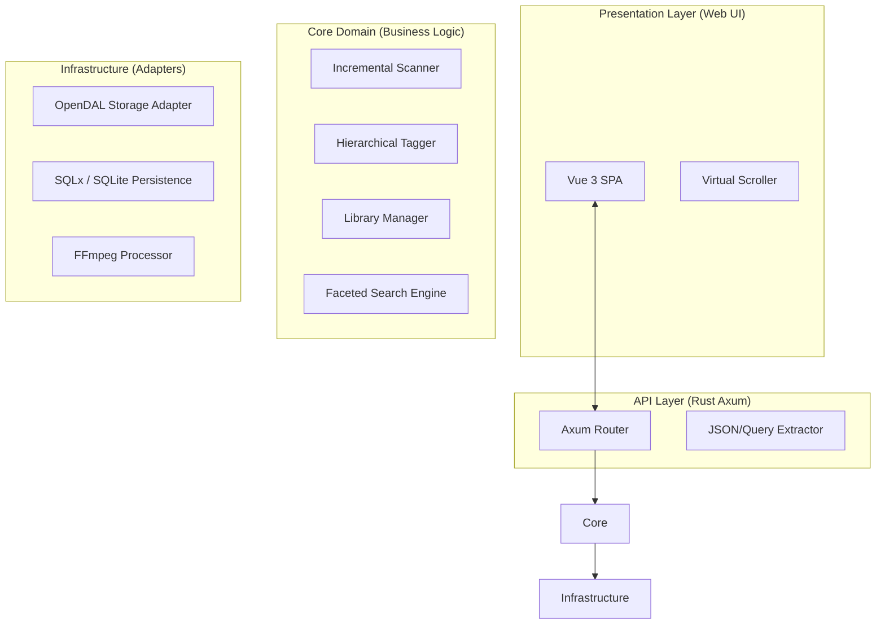

**版本：** v1.0  
**状态：** 评审通过 / 待实现  
**主要目标：** 实现一个轻量级、非侵入式、支持层级标签的多源资源管理系统。

---

## 1. 系统架构总览

系统采用 **Hexagonal Architecture (六边形架构)**，确保核心逻辑不依赖于特定的数据库驱动或文件协议。

### 1.1 逻辑分层图


---

## 2. 数据库详细设计

采用 **SQLite 3**，并强制开启 **WAL (Write-Ahead Logging)** 模式以支持高并发。

### 2.1 物理模型 (Schema)
```sql
-- 资源库定义
CREATE TABLE libraries (
    id INTEGER PRIMARY KEY AUTOINCREMENT,
    name TEXT NOT NULL,
    protocol TEXT NOT NULL,          -- 'local', 'webdav'
    base_path TEXT NOT NULL,         -- 物理路径或URL
    config_json TEXT,                -- 加密存储的凭据
    last_scanned_at DATETIME
);

-- 层级标签定义
CREATE TABLE tags (
    id INTEGER PRIMARY KEY AUTOINCREMENT,
    name TEXT NOT NULL,
    category TEXT NOT NULL,          -- 'path', 'type', 'user', 'time'
    parent_id INTEGER REFERENCES tags(id) ON DELETE CASCADE,
    UNIQUE(name, parent_id)
);

-- 文件元数据
CREATE TABLE files (
    id INTEGER PRIMARY KEY AUTOINCREMENT,
    library_id INTEGER NOT NULL REFERENCES libraries(id) ON DELETE CASCADE,
    parent_path TEXT NOT NULL,       -- 相对路径：'Projects/2024'
    filename TEXT NOT NULL,
    extension TEXT,                  -- 后缀：'jpg' (小写)
    size INTEGER NOT NULL,
    mtime INTEGER NOT NULL,          -- 修改时间戳
    hash TEXT,                       -- 头尾4KB哈希，用于移动检测
    status INTEGER DEFAULT 1,        -- 1:在线, 0:离线/丢失
    indexed_at DATETIME DEFAULT CURRENT_TIMESTAMP
);

-- 文件与标签关联 (多对多)
CREATE TABLE file_tags (
    file_id INTEGER NOT NULL REFERENCES files(id) ON DELETE CASCADE,
    tag_id INTEGER NOT NULL REFERENCES tags(id) ON DELETE CASCADE,
    source TEXT DEFAULT 'auto',      -- 'auto', 'manual'
    PRIMARY KEY(file_id, tag_id)
);
```

### 2.2 核心索引
*   `idx_files_lookup`: `(library_id, parent_path, filename)` - 用于高速扫描比对。
*   `idx_tags_hierarchy`: `(parent_id, name)` - 用于构建标签树。
*   `idx_file_tags_reverse`: `(tag_id, file_id)` - 用于基于标签的过滤查询。

---

## 3. 后端模块化设计 (Rust)

### 3.1 模块职责划分
*   `tagflow-core/src/api`: 处理 HTTP 路由、参数验证。
*   `tagflow-core/src/engine/scanner`: 实现**差异化同步算法**。
*   `tagflow-core/src/engine/tagger`: 定义 `Tagger` Trait 及具体实现（Path, Extension）。
*   `tagflow-core/src/infra/storage`: 基于 OpenDAL 的多协议访问封装。
*   `tagflow-core/src/core/tag`: 处理**递归层级标签**的缓存与创建。

### 3.2 核心 Trait 定义
```rust
/// 自动标签生成接口
pub trait Tagger {
    fn execute(&self, entry: &FileEntry) -> Vec<PendingTag>;
}

/// 待创建标签的描述
pub struct PendingTag {
    pub parts: Vec<String>,     // 层级路径：["Work", "Design"]
    pub category: TagCategory,
    pub source: TagSource,
}
```

---

## 4. 关键算法流程

### 4.1 增量扫描与标签继承 (Incremental Sync)
1.  **扫描器遍历：** 递归读取 `base_path`。
2.  **命中检查：** 数据库查询 `(path, size, mtime)`。
    *   **Case 1 (未变)：** 标记为“在线”，跳过。
    *   **Case 2 (新增/修改)：** 
        *   计算 `hash` 检查是否为移动。
        *   更新/插入 `files` 记录。
        *   **触发标签流水线：** 调用 `PathTagger` 解析路径。
3.  **层级标签处理：**
    *   输入路径：`A/B/C`
    *   `TagManager` 执行 `get_or_create`：确保 `A`(root) -> `B`(child of A) -> `C`(child of B) 链条存在。
    *   文件最终关联至叶子标签 `C`。

### 4.2 检索查询算法 (Faceted Search)
*   **深挖模式 (Drill-down)：** 当点击父标签 `A` 时，系统使用 **CTE (Common Table Expression)** 递归获取 `A` 的所有子孙标签 ID。
*   **多标签过滤：** 执行 `INTERSECT` 或 `GROUP BY + HAVING COUNT` 逻辑，实现“同时具备标签 X 和 标签 Y”的查询。

---

## 5. 接口协议 (API Contract)

### 5.1 文件检索 API
*   **Endpoint:** `GET /api/v1/files`
*   **Params:**
    *   `library_id`: 可选
    *   `tags`: 标签 ID 列表 (例如 `1,5,22`)
    *   `recursive`: 布尔值，是否包含子标签内容
    *   `page`, `limit`: 分页参数
*   **Response:**
    ```json
    {
      "items": [{ "id": 101, "filename": "logo.png", "tags": [...] }],
      "total": 1250
    }
    ```

### 5.2 标签树 API
*   **Endpoint:** `GET /api/v1/tags/tree`
*   **Description:** 返回嵌套结构的标签列表，供侧边栏目录树使用。

---

## 6. 非功能性规格

### 6.1 性能目标
*   **内存控制：** 后端进程在静态时占用 < 30MB，高频扫描时 < 150MB。
*   **查询耗时：** 10 万行级别数据，核心过滤 API 响应时间 < 150ms。

### 6.2 部署环境 (Docker)
*   使用 **Multi-stage Build**。
*   基础镜像：`alpine:latest` (内含 `ffmpeg`, `libsqlite3`)。
*   暴露端口：8080。
*   挂载卷：`/data` (数据库), `/cache` (缩略图), `/library` (用户数据)。

---

## 7. 后续开发计划 (Next Steps)

1.  **里程碑 1 (Week 1):** 环境搭建、SQLite Schema 落地、Rust 模型定义。
2.  **里程碑 2 (Week 2):** 开发 `Scanner` 与 `OpenDAL` 适配器，实现本地文件入库。
3.  **里程碑 3 (Week 3):** 开发 `TagManager` 处理层级逻辑。
4.  **里程碑 4 (Week 4):** 实现 Axum API 与 Vue 3 基础界面。

---
