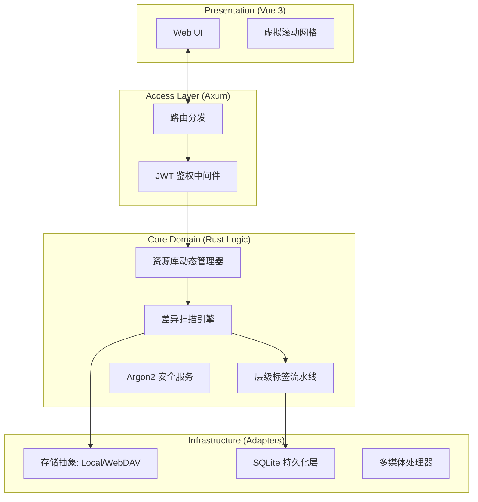
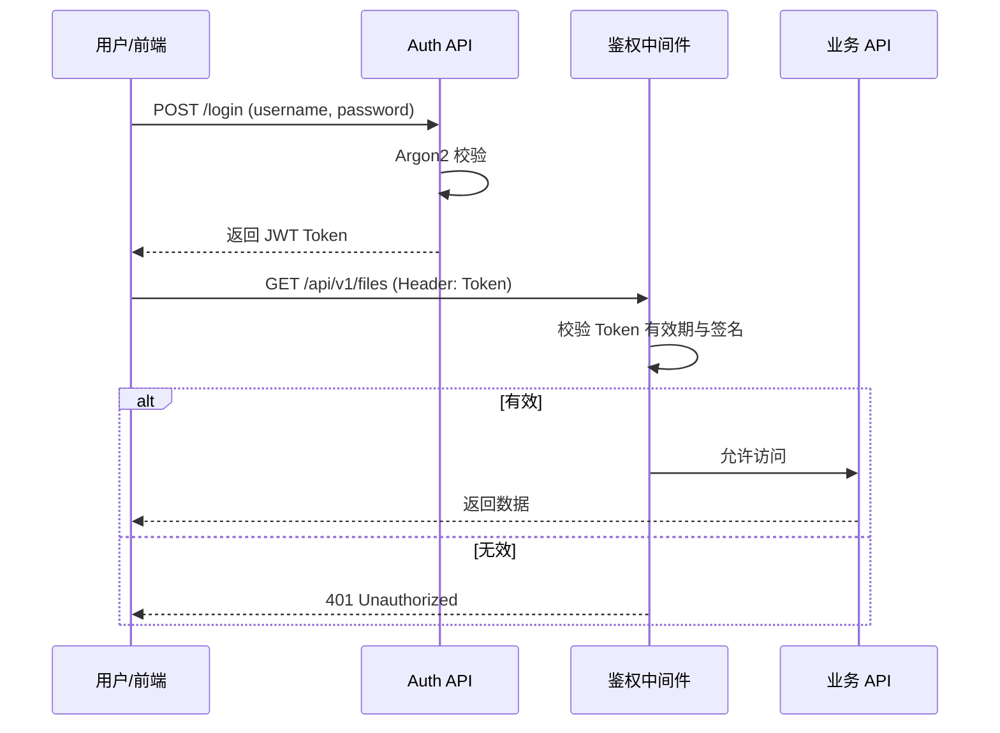

# TagFlow 系统详细设计说明书 (Detailed Design Specification)

**版本：** v1.1  
**状态：** 评审通过  
**项目定位：** 轻量级、非侵入式、高度安全的个人资源管理系统。

---

## 1. 系统架构设计

系统采用 **Hexagonal Architecture (六边形架构)**，通过依赖倒置原则确保核心逻辑与外部基础设施（存储、数据库、认证）解耦。

### 1.1 逻辑分层与数据流


---

## 2. 数据库详细设计 (SQLite 3)

强制开启 **WAL (Write-Ahead Logging)** 模式，保证后台扫描（写）与前端浏览（读）并发不阻塞。

### 2.1 物理模型 (Schema)
```sql
-- 1. 用户认证表
CREATE TABLE users (
    id INTEGER PRIMARY KEY AUTOINCREMENT,
    username TEXT NOT NULL UNIQUE,
    password_hash TEXT NOT NULL,      -- Argon2id 格式哈希
    created_at DATETIME DEFAULT CURRENT_TIMESTAMP
);

-- 2. 动态资源库定义
CREATE TABLE libraries (
    id INTEGER PRIMARY KEY AUTOINCREMENT,
    name TEXT NOT NULL,
    protocol TEXT NOT NULL,           -- 'local', 'webdav'
    base_path TEXT NOT NULL,          -- 物理路径或URL
    config_json TEXT,                 -- 存储WebDAV凭据(AES加密)或排除规则
    last_scanned_at DATETIME
);

-- 3. 层级标签定义
CREATE TABLE tags (
    id INTEGER PRIMARY KEY AUTOINCREMENT,
    name TEXT NOT NULL,
    category TEXT NOT NULL,           -- 'path', 'type', 'user'
    parent_id INTEGER REFERENCES tags(id) ON DELETE CASCADE,
    UNIQUE(name, parent_id)
);

-- 4. 文件索引
CREATE TABLE files (
    id INTEGER PRIMARY KEY AUTOINCREMENT,
    library_id INTEGER NOT NULL REFERENCES libraries(id) ON DELETE CASCADE,
    parent_path TEXT NOT NULL,        -- 相对路径：'Projects/Design'
    filename TEXT NOT NULL,
    extension TEXT,                   -- 'png' (小写)
    size INTEGER NOT NULL,
    mtime INTEGER NOT NULL,           -- 修改时间戳
    hash TEXT,                        -- 头尾哈希用于重命名检测
    status INTEGER DEFAULT 1,         -- 1:在线, 0:丢失
    indexed_at DATETIME DEFAULT CURRENT_TIMESTAMP
);

-- 5. 关联表
CREATE TABLE file_tags (
    file_id INTEGER NOT NULL REFERENCES files(id) ON DELETE CASCADE,
    tag_id INTEGER NOT NULL REFERENCES tags(id) ON DELETE CASCADE,
    source TEXT DEFAULT 'auto',
    PRIMARY KEY(file_id, tag_id)
);

-- 6. 异步任务队列
CREATE TABLE tasks (
    id INTEGER PRIMARY KEY AUTOINCREMENT,
    file_id INTEGER NOT NULL REFERENCES files(id) ON DELETE CASCADE,
    task_type TEXT NOT NULL,          -- 'thumb', 'hash'
    status INTEGER DEFAULT 0,         -- 0:待处理, 1:进行中, 2:完成, 3:失败
    retry_count INTEGER DEFAULT 0
);
```

### 2.2 核心索引策略
*   `idx_files_lookup`: `(library_id, parent_path, filename)` - 加速增量扫描比对。
*   `idx_tags_tree`: `(parent_id, name)` - 用于构建无限级标签树。
*   `idx_file_tags_reverse`: `(tag_id, file_id)` - 加速基于标签的文件过滤。

---

## 3. 核心功能模块设计 (后端 Rust)

### 3.1 认证模块 (`core/auth`)
*   **算法：** 采用 **Argon2id** 进行密码哈希。
*   **鉴权：** 基于 **JWT (Json Web Token)** 的无状态状态认证。
*   **中间件：** 实现 `AuthMiddleware` 拦截所有 `/api/v1/` 请求，校验 `Authorization: Bearer <token>`。

### 3.2 资源库管理模块 (`core/library`)
*   **动态性：** 提供 CRUD 接口，允许在系统运行时添加/删除存储源。
*   **连接测试：** 
    *   Local: 校验路径是否存在且具备读权限。
    *   WebDAV: 发起 `PROPFIND` 请求校验 Endpoint 及凭据合法性。

### 3.3 增量扫描引擎 (`engine/scanner`)
*   **算法逻辑：**
    1. 获取数据库快照 Map。
    2. 使用 **OpenDAL** 递归遍历物理存储。
    3. 比对 `(size, mtime)`：
        *   一致则保留。
        *   不一致或缺失则更新数据库，触发 `Tagger` 重新解析。
    4. 标记数据库中多余的记录为 `status=0`。

### 3.4 层级标签引擎 (`engine/tagger`)
*   **递归逻辑：** 将路径 `A/B/C` 解析为标签链。
*   **缓存机制：** 在内存中维护标签路径与 ID 的映射，减少频繁的数据库查询。

---

## 4. 关键算法流程

### 4.1 用户登录与 API 访问控制


### 4.2 基于层级标签的递归搜索
利用 SQLite 的递归 CTE 实现：
```sql
WITH RECURSIVE sub_tags(id) AS (
    SELECT id FROM tags WHERE id = ? -- 用户点击的标签
    UNION ALL
    SELECT t.id FROM tags t JOIN sub_tags st ON t.parent_id = st.id
)
SELECT * FROM files WHERE id IN (
    SELECT file_id FROM file_tags WHERE tag_id IN (SELECT id FROM sub_tags)
);
```

---

## 5. 接口协议定义 (API Contract)

### 5.1 认证类
*   `POST /api/auth/login`: 用户登录，返回 Token。

### 5.2 存储管理类
*   `GET /api/v1/libraries`: 列出所有存储池。
*   `POST /api/v1/libraries`: 添加新源（支持 Local/WebDAV）。
*   `POST /api/v1/libraries/test`: 验证连接。

### 5.3 资源操作类
*   `GET /api/v1/files`: 多维过滤查询（支持分页、标签 ID、递归开关）。
*   `GET /api/v1/tags/tree`: 获取完整层级标签树结构。
*   `GET /api/v1/files/:id/thumbnail`: 获取 WebP 格式缩略图。

---

## 6. 非功能性需求与部署

### 6.1 安全性设计
*   **非侵入式：** 只读挂载物理卷，数据库独立存储。
*   **机密保护：** WebDAV 密码在数据库中加密存储，API 全程受 JWT 保护。

### 6.2 性能设计
*   **后端：** 利用 Rust 的协程（Tokio）处理并发扫描与缩略图任务。
*   **前端：** 虚拟滚动技术支持 10 万+ 文件平滑展示。

### 6.3 容器化交付
*   **单二进制：** 前端静态产物通过 `rust-embed` 嵌入二进制。
*   **Docker：** 基于 Alpine 构建，包含 `ffmpeg` 运行环境，镜像大小目标 < 100MB。

---

## 7. 下一步开发里程碑 (Roadmap)

1.  **[M1-M5] 已规划：** 核心引擎、扫描算法、层级标签、基础 UI。
2.  **[M2] 核心引擎：** 实现增量扫描引擎。
3.  **[M3] 层级标签引擎：** 实现物理路径自动转化为逻辑上的层级标签。
4.  **[M4] API 层与虚拟视图：** 框架构建 RESTful 接口，将数据库中的元数据暴露给前端。
5.  **[M5] 前端基础架构：** 搭建前端框架，实现文件列表虚拟滚动。
6.  **[M6] 访问安全：** 实现 Argon2/JWT 登录流与中间件。
7.  **[M7] 存储管理：** 实现动态库管理 API 与 UI。
8.  **[M8] 多媒体处理：** 异步任务 Worker 与 FFmpeg 缩略图生成。
9.  **[M9] 发布部署：** 打包单文件二进制与 Docker 镜像。

